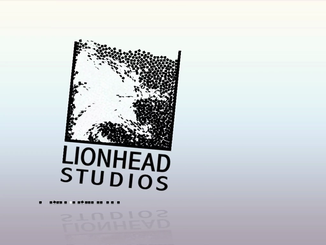

# The Movies — Static Recompilation

Static recompilation of **The Movies** and its expansion **Stunts & Effects**
(Lionhead Studios / Activision, 2005-2006) from the shipping Win32 binary to
native C.

Built on the [pcrecomp](https://github.com/sp00nznet/pcrecomp) toolchain and
following its shared house style (layout, CLI, harness, headless mode). It sits
next to [bw](https://github.com/sp00nznet/bw) and [bw2](https://github.com/sp00nznet/bw2):
same studio, same years.

## Status: **v0.1.0-dev, P3 bring-up. The whole game is lifted, boots, and renders its Lionhead intro in real time.**

| Stage | State |
|---|---|
| P0: pick the build, identify the binaries | done: the Steam 1.2 build, `MoviesSE.exe` ([RECON.md](docs/RECON.md)) |
| Unpack (PECompact 2.x + Steam2 wrapper) | **done, headless**: all three executables ([unpacking.md](docs/unpacking.md)) |
| RTTI class recovery | done: 1,992 classes, 2,530 vtables, 9,227 virtual methods |
| Function catalog (`disasm32`) | 82,109 functions, 84.6% of `.text`, **7 minutes** (was 143) |
| Recovery score against IDA | recall 69.7%, exact ends 91.2%. The "invented" count (35k) is mostly C++ EH funclets IDA does not call functions ([RECON.md](docs/RECON.md#the-first-catalog)) |
| Lift (`run_lift.py --all`) | 83,468 functions, 9.8M lines of C, **0 lift errors**, 10 unresolvable ITAIL labels (none in a real function) |
| Host (`build/themovies.exe`, 32-bit, pcrecomp `native32`) | **boots**: CRT, `WinMain`, localized text, hidden window, D3D9 device, worker threads ([host.md](docs/host.md), [bringup.md](docs/bringup.md)) |
| Headless mode | `--headless --record out.mp4 --frames N`: hidden window, forced-windowed D3D9, every frame read back and piped to ffmpeg |
| Conformance harness | `tools/conformance.py`: boot milestones and lift health against `conformance.json`; fails on regression |

Every stage above has its real output in `docs/`. [bringup.md](docs/bringup.md)
is the log of each wall and its fix; most of them were pcrecomp fixes (#5, #7,
#10 to #15), which is half the point of this project.

## Screenshots

The Lionhead intro, rendered by the recompiled game and recorded headlessly
(`--headless --record`) over RDP, at 1 s, 10 s and 19 s:

| | | |
|---|---|---|
|  |  |  |

## What it found so far

**The Steam build is packed, and the packer is the DRM.** All three executables
are PECompact 2.x with Valve's Steam2 ownership check inside the unpacker
stub. That meant a new toolkit tool, `emu_unpack.py`, which runs the stub under
Unicorn instead of Windows: no Steam, no window, the same bytes every time.

```
$ py -3 ../tools/tools/drm/emu_unpack.py game/MoviesSE.exe work/MoviesSE.unpacked.exe
OEP 0x00AD2451; 330 imports in 11 IAT runs from 11 DLLs; 336 thunks handed out
  advapi32.dll: 10
  gdi32.dll: 3
  kernel32.dll: 191
  ...
wrote work/MoviesSE.unpacked.exe
```

**RTTI was left on.** 1,312 classes in namespace `TM` (the game) and 204 in
`MV` (the engine), plus Lionhead's own Flash player (`LSWF`). This is the
best-named Lionhead binary in the collection. Black & White had to recover its
569 types by hand.

**Direct3D is not in the import table.** `d3d9`, `dinput8`, `dsound`/OpenAL
and `WMVCore` all come in through `LoadLibrary`, so the host's import bridge has
to cover `GetProcAddress` from day one.

## Getting Started

You need **your own copy of The Movies**: the Steam build (app 7900, with
Stunts & Effects, app 7910). Nothing from the game is in this repository and
nothing is downloaded for you. A retail DVD install is not supported yet: its
executables use different protection ([ROADMAP.md](ROADMAP.md)).

### Quick start

1. Download this repository (the green **Code** button, then **Download ZIP**)
   and unzip it somewhere with 4 GB free.
2. Double-click **`Setup.cmd`**.

It checks for Python 3.10+, the `pefile`, `capstone` and `unicorn` packages and
the pcrecomp toolkit, and **asks** before installing any of them. It finds The
Movies in your Steam library, or asks you for the folder. Then it copies the
game into `game\`, unpacks the executables, analyses them and builds the
function catalog. A rerun skips the finished steps. If it stops, it says why
in one sentence, and the details are in `setup.log`.

It ends with `work\` holding the unpacked executables and the catalog. There is
no game to launch yet, so there is no shortcut.

### Step by step

Prerequisites: Windows 10/11, **Python 3.10+** (`py -3 --version` should say
`Python 3.10` or later), **git**, and the pcrecomp toolkit cloned **beside**
this repository as `tools`:

```
some-folder\
  tools\        <- git clone https://github.com/sp00nznet/pcrecomp tools
  themovies\    <- this repository
```

1. Python packages:
   ```
   py -3 -m pip install --user pefile capstone unicorn
   ```
2. Copy your install into `game\` (the folder holding `Movies.exe`):
   ```
   robocopy "C:\Program Files (x86)\Steam\steamapps\common\The Movies" game /E
   ```
3. Unpack the executables (a few seconds each):
   ```
   py -3 ..\tools\tools\drm\emu_unpack.py game\MoviesSE.exe work\MoviesSE.unpacked.exe
   py -3 ..\tools\tools\drm\emu_unpack.py game\Movies.exe work\Movies.unpacked.exe
   py -3 ..\tools\tools\drm\emu_unpack.py game\StarMaker.exe work\StarMaker.unpacked.exe
   ```
   Expected: `OEP 0x00AD2451; 330 imports in 11 IAT runs from 11 DLLs; 336 thunks handed out`
   for `MoviesSE.exe`, and the table in [unpacking.md](docs/unpacking.md) for the others.
4. Headers, imports and C++ classes:
   ```
   py -3 ..\tools\tools\pe\pe_analyze.py work\MoviesSE.unpacked.exe --json work\pe_analysis.json
   py -3 ..\tools\tools\cpp\rtti.py work\MoviesSE.unpacked.exe -o work\rtti.json --seeds work\rtti_seeds.json
   ```
   Expected from `rtti.py`: `classes : 1,992` and `virtual methods : 9,227`.
5. The function catalog (long: a couple of hours):
   ```
   py -3 ..\tools\tools\disasm\disasm32.py work\MoviesSE.unpacked.exe -o work\functions.json --seed-functions work\rtti_seeds.json
   ```

The usual trip-ups: `python` opening the Microsoft Store (that is Windows' alias
placeholder; use `py -3`, or turn the alias off in *Settings > Apps > Advanced
app settings > App execution aliases*); a freshly installed Python not being on
`PATH` until you open a new window; and an older pcrecomp without
`tools\drm\emu_unpack.py` (`git -C ..\tools pull`).

## Usage

There is no program to run yet. The pipeline commands are the ones in *Step by
step*. `emu_unpack.py --selftest` checks the unpacker's IAT picker without
needing the game.

## Building from source

Needs the *Step by step* outputs (`work\MoviesSE.unpacked.exe`,
`work\functions.json`) plus **Visual Studio 2022** (any edition, or the Build
Tools) with the C++ x86 tools, and **CMake 3.20+** with Ninja. The host is
32-bit on purpose ([host.md](docs/host.md)).

```
py -3 run_lift.py --all           # the whole catalog -> src\recomp\gen\ (9.8M lines, not committed)
build.cmd                         # vcvarsall amd64_x86 + CMake + Ninja -> build\themovies.exe (~15 min)
build\themovies.exe --headless --run --watchdog 120
py -3 tools\conformance.py        # how far it boots, against conformance.json
```

Until pcrecomp #7 and #10 to #15 are merged, use a checkout with all of them
merged, for both the lifter and the build (they must match):
`set PCRECOMP=..\pcrecomp-integration` before `run_lift.py`, and
`set CMAKE_ARGS=-DPCRECOMP=G:/path/to/pcrecomp-integration` before the first
`build.cmd` (delete `build\` if you change it later).

## Layout

```
themovies/
  Setup.cmd          the Quick start (runs tools\setup.ps1)
  run_lift.py        lift driver: closure from the OEP over pcrecomp's lift32
  CMakeLists.txt, build.cmd   the 32-bit host build
  src/runtime/host.c the host: game-specific parts on pcrecomp runtime/native32
  src/recomp/gen/    lifted C (generated, gitignored)
  tools/setup.ps1    the same steps as "Step by step", with checks and a log
  analysis/          catalog, sections (packed), headers and imports (unpacked)
  docs/
    RECON.md         which build, the binaries, imports, RTTI namespaces, data
    unpacking.md     the packer, the Steam2 check, and the IAT that was there twice
    host.md          why the host is 32-bit, --headless, the first run, exit codes
  game/              your install (gitignored)
  work/              unpacked executables, RTTI map, catalog (gitignored)
```

Unpacked executables, the RTTI class map and the function catalog are derived
from the game's binary, so they are never committed. The generated C will not
be either.

## License

MIT for what is ours: the scripts and the documentation. It does not reach the
game, or anything unpacked or lifted from it. [LICENSE](LICENSE) spells that
out.

## Credits

The Movies © 2005-2006 Lionhead Studios / Activision. This project neither
contains nor distributes any part of it.

Built on [pcrecomp](https://github.com/sp00nznet/pcrecomp), which stands on
[capstone](https://www.capstone-engine.org/), [Unicorn](https://www.unicorn-engine.org/),
[pefile](https://github.com/erocarrera/pefile) and IDA Pro.
